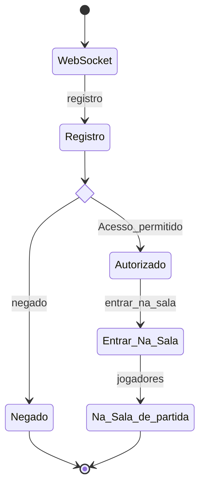

# SMU 2023.1 Máquinas de estado

## Registro e entrada na sala de partida:

```mermaid
stateDiagram-v2
    [*] --> WebSocket
    WebSocket --> Registro : registro
    state if_registro <<choice>>
    Registro -->  if_registro
    if_registro --> Negado: negado
    if_registro --> Autorizado: Acesso_permitido
    Negado --> [*]
    Autorizado --> Entrar_Na_Sala : entrar_na_sala
    Entrar_Na_Sala --> Na_Sala_de_partida: jogadores
    Na_Sala_de_partida --> [*]
```
        
